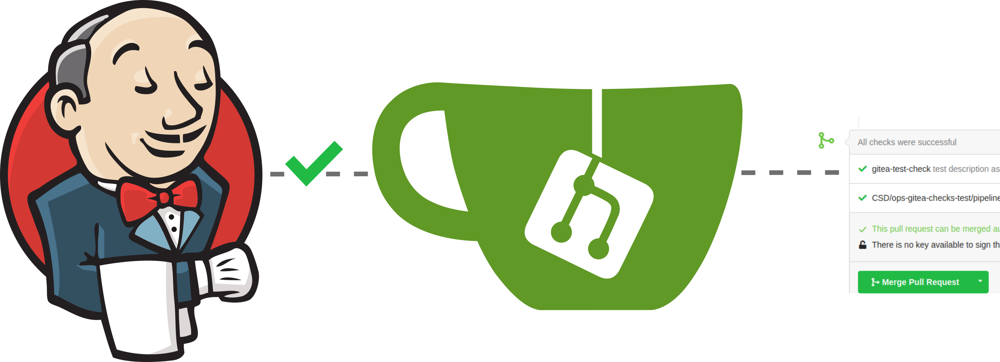
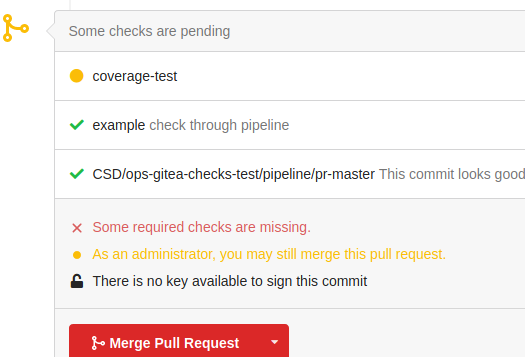
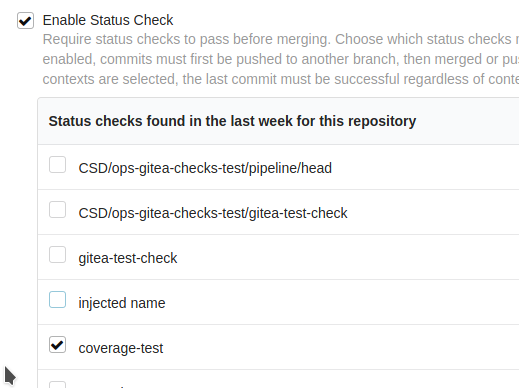

# Gitea Checks API Plugin

This plugin publishes checks to Gitea through Gitea API, while it implements the extension points defined in 
[Checks API Plugin](https://github.com/jenkinsci/checks-api-plugin). It is an adapted version of the 
[github-checks-plugin](https://github.com/jenkinsci/github-checks-plugin), which uses the Gitea API client
from [gitea-plugin](https://github.com/jenkinsci/gitea-plugin).

- [Features](#features)
  - [Build Status Check](#build-status-check)
 - [Contributing](#contributing)
 - [Acknowledgements](#acknowledgements)
 - [LICENSE](#license)
 
## Features

*Prerequsite: Jenkins needs to have a valid *Gitea server* configuration with Gitea API credentials in Jenkins settings .*

### Build Status Check

This plugin implements [the status checks feature from Checks API Plugin](https://github.com/jenkinsci/checks-api-plugin#build-status-check) 
to publish statuses (pending, in progress, and completed) to Gitea.

Gitea commit status are rather simple compared to GitHub checks: Gitea commit status show the *state*, a *check context*
used as a identifier for a specific check and a *check description*. The *check context* can be used in Gitea to specify
required checks for a specific branch (See `Gitea Branch Protection`).

## Contributing

Refer to our [contribution guidelines](https://github.com/jenkinsci/.github/blob/master/CONTRIBUTING.md)

## Acknowledgements

Thanks to the developers of the [gitea-plugin](https://github.com/jenkinsci/gitea-plugin) to provide the *Gitea*
integration into Jenkins. Publishing checks to *GIT* providers in this way wouldn't be possible without the Jenkins
ecosystem: The [Checks API Plugin](https://github.com/jenkinsci/checks-api-plugin) provides the necessary base and
the [github-checks-plugin](https://github.com/jenkinsci/github-checks-plugin) provides a reference implementation.
With these prerequisites it was straight forward to copy the [github-checks-plugin](https://github.com/jenkinsci/github-checks-plugin)
implementation and adapt it to the more simpler *Gitea*.

This plugin was started as a [Google Summer of Code 2020 project](https://summerofcode.withgoogle.com/projects/#5139745388101632), special thanks to the support from [Jenkins GSoC SIG](https://www.jenkins.io/sigs/gsoc/) and the entire community.

## LICENSE

Licensed under MIT, see [LICENSE](LICENSE)
